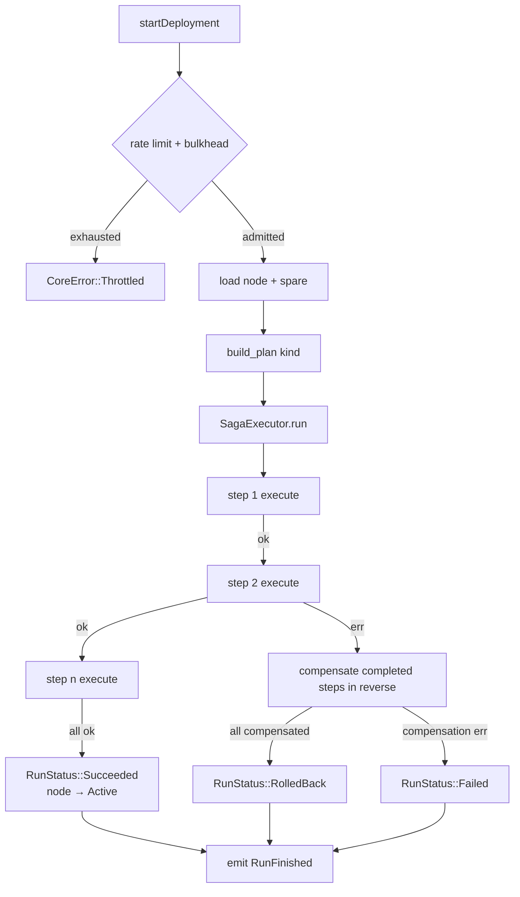
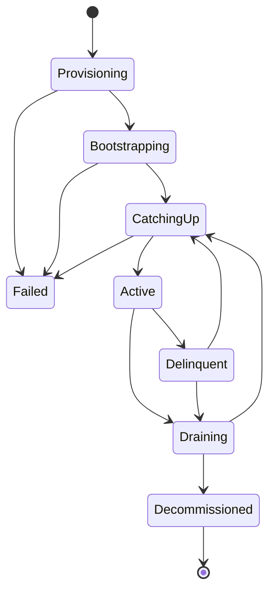

# ValidatorForge

**A Solana validator-fleet operations control plane — compensating-saga deployments served
over a resilient, observable GraphQL API.**

ValidatorForge orchestrates the lifecycle of a fleet of Solana validators: provisioning new
nodes, performing **zero-downtime version upgrades**, executing **hot-spare failover**, and
decommissioning hosts. Each operation runs as a **compensating SAGA** — if any step fails, the
already-completed steps are rolled back in reverse — and drives a **type-state node lifecycle**
in which illegal transitions cannot be represented. It renders the exact **Terraform + Ansible**
a deployment will run, asks an **agentic AI advisor** what to do about an unhealthy node, and
streams every state change to subscribers over GraphQL.

It is built to the same production bar as the rest of this workspace — hexagonal architecture,
no `unwrap`/`panic` on runtime paths, the **full resilience stack on every host operation**,
structured tracing, Prometheus metrics, and a full test + benchmark suite.

> Part of an eight-project Solana-infrastructure portfolio. ValidatorForge is the **flagship
> control plane**: it headlines the **compensating-saga** orchestration pattern, a **type-state
> lifecycle**, and the **fully-composed resilience stack** (timeout + retry + circuit breaker +
> rate limit + bulkhead).

[](https://github.com/ABHIJEET-MUNESHWAR/ValidatorForge/actions/workflows/ci.yml)[](https://www.rust-lang.org)[](https://doc.rust-lang.org/edition-guide/)[](Cargo.toml)[](.github/workflows/ci.yml)[](.github/workflows/ci.yml)[](.github/workflows/ci.yml)[](https://github.com/rust-secure-code/safety-dance)[](https://tokio.rs)[](https://async-graphql.github.io)[](Dockerfile)[](#)[](https://github.com/ABHIJEET-MUNESHWAR/ValidatorForge/commits)[](https://github.com/ABHIJEET-MUNESHWAR/ValidatorForge/issues)[](https://github.com/ABHIJEET-MUNESHWAR/ValidatorForge/stargazers)

---

## Table of Contents

- [Why this design](#why-this-design)
- [Architecture](#architecture)
  - [Crate layout](#crate-layout)
  - [Deployment saga flow](#deployment-saga-flow)
  - [Node lifecycle (type-state)](#node-lifecycle-type-state)
- [Quick start](#quick-start)
  - [`plan` — real output](#plan--real-output)
- [GraphQL API](#graphql-api)
  - [Mutations](#mutations)
  - [Queries](#queries)
  - [Subscription](#subscription)
- [Resilience model](#resilience-model)
- [AI advisor](#ai-advisor)
- [Observability](#observability)
- [CLI](#cli)
- [Development](#development)
  - [Test results](#test-results)
  - [Benchmarks](#benchmarks)
  - [Docker](#docker)
- [Status & limitations](#status--limitations)
- [License](#license)

---

## Why this design

| Decision | Rationale |
|---|---|
| **Compensating SAGA** | A multi-host deployment is a distributed transaction with no global rollback. Each step (`apply_infra`, `tune_host`, `start_validator`, `await_catchup`, `drain`, `swap_identity`, `destroy_infra`) carries its own compensation; on failure the executor runs the completed steps' compensations **in reverse**, leaving the fleet in a consistent state. |
| **Type-state node lifecycle** | `NodeState` encodes a state machine (`Provisioning → Bootstrapping → CatchingUp → Active → {Delinquent, Draining} → …`). `transition_to` rejects illegal moves at the domain boundary, so a node can never jump from `Decommissioned` back to `Active`. |
| **Full resilience stack, composed** | Every `NodeAgent` effect runs under timeout → retry/backoff → circuit breaker; deployment admission is gated by a token-bucket rate limiter **and** a bounded bulkhead. Real fleet ops talk to flaky hosts; each guard is warranted. |
| **IaC renderer** | The `IacRenderer` port emits real, reviewable Terraform (bare-metal device) and Ansible (per-action tasks) so an operator can audit a plan before it runs — the seam to a live executor. |
| **Agentic AI advisor** | `OpsAdvisor` is a port. `HeuristicAdvisor` applies deterministic ops rules; the optional `LlmAdvisor` augments it and **falls back** to the heuristic on any provider error — AI never blocks the control plane. |
| **Event-sourced audit stream** | Every state change is a typed `OpsEvent` published to an event bus and fanned out to GraphQL subscribers — an audit log and a live UI feed in one. |
| **Newtypes everywhere** | `NodeId`, `ClusterName`, `HostAddr`, `ValidatorVersion`, `Slot`, `RunId` are validated newtypes — malformed input cannot enter the domain. |

---

## Architecture

Hexagonal / ports-and-adapters. Dependencies point inward; the domain core knows nothing about
GraphQL, axum, sqlx, or the concrete host executor.

### Crate layout

```
                         ┌────────────────────────────────────────────┐
                         │           validatorforge-node (bin)         │
                         │  CLI (serve / plan) · axum · WS · telemetry  │
                         └───────────────┬────────────────────────────┘
                                         │ composes
        ┌───────────────┬───────────────┼───────────────┬───────────────┐
        │               │               │               │               │
 ┌──────▼──────┐ ┌──────▼──────┐ ┌──────▼──────┐ ┌──────▼──────┐         │
 │ ...-api     │ │ ...-infra   │ │ ...-ai      │ │ ...-core    │         │
 │ async-      │ │ sim agent · │ │ heuristic + │ │ engine ·    │         │
 │ graphql     │ │ pg repo ·   │ │ llm advisor │ │ saga · ports│         │
 │ Q/M/S       │ │ iac · events│ │             │ │ resilient   │         │
 └──────┬──────┘ └──────┬──────┘ └──────┬──────┘ └──────┬──────┘         │
        │               │ implements ports              │ uses          │
        │               └───────────────┬───────────────┘               │
        │                               │                ┌──────────────▼─────────────┐
        │                               │                │   validatorforge-resilience │
        │                               │                │ timeout·retry·breaker·rate· │
        │                               │                │ bulkhead (generic over Clock)│
        │                               │                └──────────────┬─────────────┘
        └───────────────────────────────▼───────────────────────────────┘
                              ┌────────────────────────────┐
                              │      validatorforge-types   │
                              │ NodeId · HostAddr · Version  │
                              │ ValidatorNode (type-state) · │
                              │ DeploymentRun · errors (noI/O)│
                              └────────────────────────────┘
```

| Crate | Responsibility | Key deps |
|---|---|---|
| `validatorforge-types` | Pure domain: validated ids, `ValidatorNode` type-state aggregate, `DeploymentKind`, `DeploymentRun`, health, error enums. No I/O. | `chrono`, `serde`, `thiserror` |
| `validatorforge-resilience` | Reusable, clock-generic guards: `with_timeout`, `RetryPolicy`, `CircuitBreaker`, `RateLimiter`, `Bulkhead`. No `rand`. | `tokio`, `futures` |
| `validatorforge-core` | Ports (`NodeAgent`, `NodeRepository`, `EventSink`, `EventStream`, `OpsAdvisor`, `IacRenderer`, `Clock`), the `OpsEngine`, the `SagaExecutor`, the `ResilientNodeAgent` decorator, `OpsEvent`, config. | `async-trait`, `metrics`, `mockall` |
| `validatorforge-infra` | Adapters: `SimNodeAgent`, in-memory + partitioned-Postgres repositories, `BroadcastEventSink`, `DefaultIacRenderer`, `UtcClock`. | `dashmap`, `tokio`, `sqlx` (feat) |
| `validatorforge-ai` | `OpsAdvisor` impls: `HeuristicAdvisor` (always) + `LlmAdvisor` (feat `llm`). | `serde_json`, `reqwest` (feat) |
| `validatorforge-api` | `async-graphql` schema — query + mutation + subscription roots, DTOs. | `async-graphql` |
| `validatorforge-node` | Composition root + binary: CLI, axum + WS wiring, tracing, Prometheus, graceful shutdown, `plan` job, criterion bench. | `axum`, `clap`, `tokio`, `metrics-exporter-prometheus` |

### Deployment saga flow



Each `NodeAgent` effect inside a step runs under **timeout → retry/backoff → circuit breaker**
via the `ResilientNodeAgent` decorator.

### Node lifecycle (type-state)



`ValidatorNode::transition_to` returns `Err(DomainError::IllegalTransition)` for any edge not in
this diagram.

---

## Quick start

```bash
# Run the GraphQL ops API (GraphiQL at http://localhost:8080/graphql)
cargo run -p validatorforge-node -- serve

# Render the Terraform + Ansible a deployment would run — no infrastructure touched
cargo run -p validatorforge-node -- plan --kind provision
cargo run -p validatorforge-node -- plan --kind upgrade --version 2.1.0
```

### `plan` — real output

`plan` renders the IaC for a deployment kind deterministically:

```text
# === Terraform ===
# Terraform plan for val-01 (testnet) — provision
resource "metal_device" "val-01" {
  hostname         = "val01.internal"
  plan             = "m3.large.x86"
  metro            = "fr"
  operating_system = "ubuntu_22_04"
  billing_cycle    = "hourly"
  tags             = ["solana", "testnet", "voting"]
}

# === Ansible (saga steps) ===
# step 1 — apply_infra
- name: base bootstrap (users, firewall, fail2ban)
  hosts: val01.internal
  become: true
  ...
# step 2 — tune_host
- name: performance tuning (sysctl, hugepages, CPU governor=performance, NIC rings)
  ...
# step 3 — start_validator
# step 4 — await_catchup
```

---

## GraphQL API

A single `/graphql` endpoint (GraphiQL on GET, queries/mutations on POST) plus a
`/graphql/ws` WebSocket for subscriptions. Errors carry a stable `code` extension.

### Mutations

```graphql
mutation {
  registerNode(input: {
    id: "eu-val-01", clusterName: "eu-fiber", cluster: TESTNET,
    host: "val01.internal", role: VOTING, version: "2.0.14"
  }) { id state }                       # -> state: "provisioning"
}

mutation {
  startDeployment(input: { nodeId: "eu-val-01", kind: PROVISION }) {
    id status completedSteps            # -> status: "succeeded", 4 steps
  }
}

# Zero-downtime upgrade (targetVersion required); failover requires `spare`
mutation {
  startDeployment(input: { nodeId: "eu-val-01", kind: UPGRADE, targetVersion: "2.1.0" }) {
    status completedSteps
  }
}
```

### Queries

```graphql
query {
  health { status nodes }
  nodes { id cluster host role state version }
  runs(limit: 20) { id kind status completedSteps startedAt finishedAt }
  advise(nodeId: "eu-val-01", context: "CVE disclosed")   # -> JSON recommendation
}
```

### Subscription

```graphql
subscription {
  opsEvents { kind payload }            # run_started, step_completed, node_state_changed, …
}
```

---

## Resilience model

Every guard lives in `validatorforge-resilience` (generic over a `Clock` so tests are
deterministic) and is composed by the engine:

| Guard | Where | Failure mode |
|---|---|---|
| **Timeout** | each `NodeAgent` effect | aborts a hung host op |
| **Retry + backoff** | `ResilientNodeAgent` | retries only `is_retryable` port errors, equal-jitter exponential backoff (no `rand`) |
| **Circuit breaker** | `ResilientNodeAgent` | trips open after N failures → `CircuitOpen`, half-opens after cooldown |
| **Rate limiter** | `OpsEngine::start_deployment` | token bucket → `Throttled` |
| **Bulkhead** | `OpsEngine::start_deployment` | bounds concurrent deployments → `Throttled` |
| **GraphQL depth/complexity** | schema | caps query cost (12 / 256) |
| **Saga compensation** | `SagaExecutor` | reverse-order rollback on partial failure |

---

## AI advisor

`advise(nodeId, context)` returns a structured JSON `Recommendation { action, urgency, rationale }`.
The default `HeuristicAdvisor` applies ordered ops rules (failed → investigate; delinquent voting
node → failover; CVE/upgrade context → upgrade; high slot-lag while active → tune host; in-flight
→ hold). Building with `--features llm` enables the `LlmAdvisor`, which calls a chat model under
retry + timeout and **gracefully falls back** to the heuristic on any provider error.

---

## Observability

- `tracing` spans on every request and saga step; `--log-json` for structured logs.
- Prometheus `/metrics` via `metrics-exporter-prometheus`: `validatorforge_deploy_throttled_total`,
  agent attempt/failure counters, `validatorforge_graphql_requests_total`.
- The `OpsEvent` stream is itself an audit log of every state change.
- Optional metrics stack: `docker compose --profile monitoring up` (Prometheus on `:9090`).

---

## CLI

```text
validatorforge-node serve   # run the GraphQL API (env: VALIDATORFORGE_HOST/PORT/...)
validatorforge-node plan    # render Terraform + Ansible for a deployment kind
  --kind <provision|upgrade|failover|decommission>  --id --cluster-name --host --version --spare
```

---

## Development

```bash
cargo fmt --all
cargo clippy --workspace --all-targets --all-features -- -D warnings
cargo test --workspace --all-features
```

### Test results

**99 tests**, all green:

| Crate | Tests | Focus |
|---|---|---|
| `validatorforge-types` | 24 | newtype validation, type-state transitions, run aggregate |
| `validatorforge-resilience` | 21 | timeout, retry/backoff, breaker, rate limit, bulkhead (ManualClock) |
| `validatorforge-core` | 18 | saga forward/rollback/failed paths, engine admission, resilient agent |
| `validatorforge-infra` | 12 | sim agent call log, in-memory + pg repo, IaC render, event bus |
| `validatorforge-ai` | 8 | heuristic rules, llm fallback |
| `validatorforge-api` | 6 | GraphQL schema execution (register/deploy/advise/health) |
| `validatorforge-node` | 10 | CLI parsing, axum handlers (`oneshot`), plan render |

### Benchmarks

```bash
cargo bench -p validatorforge-node                       # saga build_plan + IaC render
cargo bench -p validatorforge-node -- --profile-time 10  # pprof flame graph
```

### Docker

```bash
docker build -t validatorforge .
docker run --rm -p 8080:8080 validatorforge            # serve
docker run --rm validatorforge plan --kind upgrade --version 2.1.0
```

---

## Status & limitations

`SimNodeAgent` models host operations in-process rather than driving real SSH/Ansible/Terraform;
the `NodeAgent` port and the `IacRenderer` are the seam for a live executor. The default store is
in-memory; the `postgres` feature provides a partitioned `PgNodeRepository`. Single control-plane
node (no leader election). See [`EVALUATION.md`](EVALUATION.md) for a full guideline-by-guideline
self-assessment.

---

## License

Apache-2.0.
